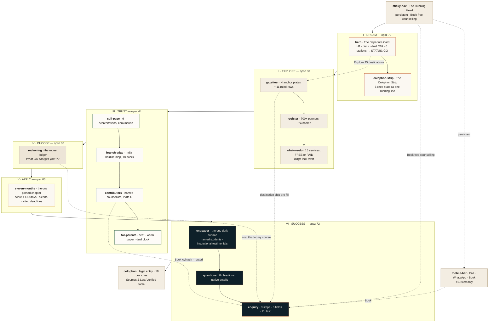

# 01 — Creative Vision & Brand

This document is the narrative and brand half of the Global Opportunities landing-page blueprint. It exists so that a designer opening Figma, a copywriter opening a doc, or an engineer opening `app/page.tsx` all start from the same story, the same references, the same voice, and the same page architecture. It states what **The Departure Atlas** is, why it was chosen over every other available direction, which real-world references to steal from and which to ignore, how the brand speaks and looks, and how the sixteen canonical sections are ordered, paced and monetised. It does **not** restate tokens (see `04-design-system.md`), section-level copy and layout (see `02-sections-part1.md` and `03-sections-part2.md`), motion timing (see `05-motion-blueprint.md`), or SEO/conversion/measurement strategy (see `06-strategy.md`). Every value quoted here is taken verbatim from the creative canon; nothing on this page introduces a number, hex, or phrase the canon does not already contain.

---

## Table of contents

1. [Creative vision](#1-creative-vision)
   - 1.1 [The name and the premise](#11-the-name-and-the-premise)
   - 1.2 [The four grafts](#12-the-four-grafts)
   - 1.3 [How it beats the category clichés](#13-how-it-beats-the-category-clichés)
2. [Mood board & inspiration references](#2-mood-board--inspiration-references)
   - 2.1 [Reference table](#21-reference-table)
   - 2.2 [Anti-references](#22-anti-references)
3. [Brand direction](#3-brand-direction)
   - 3.1 [Personality sliders](#31-personality-sliders)
   - 3.2 [Tone of voice](#32-tone-of-voice)
   - 3.3 [Art direction summary](#33-art-direction-summary)
   - 3.4 [The v1 zero-photography Plate System](#34-the-v1-zero-photography-plate-system)
   - 3.5 [The v2 photography shot list](#35-the-v2-photography-shot-list)
   - 3.6 [Iconography stance: drafted marks, and a gated icon set](#36-iconography-stance-drafted-marks-and-a-gated-icon-set)
   - 3.7 [Logo treatment on the page](#37-logo-treatment-on-the-page)
4. [Landing page information architecture](#4-landing-page-information-architecture)
   - 4.1 [The arc, mapped to the sixteen sections](#41-the-arc-mapped-to-the-sixteen-sections)
   - 4.2 [Flow diagram](#42-flow-diagram)
   - 4.3 [Prose walkthrough of the arc](#43-prose-walkthrough-of-the-arc)
   - 4.4 [Attention and emotion pacing curve](#44-attention-and-emotion-pacing-curve)
   - 4.5 [Lead-capture surface map](#45-lead-capture-surface-map)
   - 4.6 [Scroll-length budget](#46-scroll-length-budget)
5. [Open questions resolved in this document](#5-open-questions-resolved-in-this-document)

---

## 1. Creative vision

### 1.1 The name and the premise

The concept is called **THE DEPARTURE ATLAS — Volume XXV**. Global Opportunities does not publish a website; it publishes an atlas — the twenty-fifth annual edition of a reference work about leaving India to study, compiled by a firm that has been doing exactly that since one office in Amritsar in 2001. The premise is declared in the first hairline-ruled line on the page, a running head that never lies about what follows: `GLOBAL OPPORTUNITIES · AN ATLAS OF DEPARTURES · VOL. XXV · EST. AMRITSAR 2001`. Everything under that rule obeys the promise. The page is indexed, it is ruled, it is footnoted, it has a colophon, and every claim inside it resolves to a source and a last-verified date. The form is not decoration wrapped around marketing; the form *is* the argument.

That single framing solves four problems simultaneously, and it was chosen because it solves them simultaneously rather than because it is pretty. First, it gives a twenty-five-year-old company a shape that **encodes** longevity instead of asserting it — a Volume XXV cannot be faked by a firm founded last year, whereas "India's leading consultant" can be typed by anyone. Second, it gives a category drowning in flag tiles and cap-toss stock a visual language nobody occupies: cream paper, iron-gall ink, marine as the institutional anchor, sienna as the accent, hairlines at ink weights, cartography as furniture. Third, it grants permission to be **still** — an atlas that jitters is not an atlas — and stillness is the correct move in a category where the buyer's dominant emotion is fear of fraud and where roughly 75% of credibility attribution traces to design choices rather than content. Fourth, and decisively for v1, an atlas has always contained **plates**, and a plate is a frame with a caption; this is the only direction in the pack that ships premium with zero photography and looks deliberate for it rather than under-resourced.

The story runs in six chapters, numbered in the margin: **I DREAM · II EXPLORE · III TRUST · IV CHOOSE · V APPLY · VI SUCCESS.** Chapter I states GO's own buried motto at enormous scale — *Step out without doubt* — a four-word line that has sat unused on the About page while the homepage led with fear. Chapter II refuses the flag grid and indexes fifteen destinations as a gazetteer of ruled rows carrying real partner counts, real intake windows, real tuition bands and real post-study-work rights. Chapter III goes deliberately still under the headline *Nothing here casts a shadow*, engraves six real accreditations as typographic blocks, unfolds a hairline map of India with eighteen addressed doors on it, and then turns the page and speaks — for one entire chapter, in serif, on warmer paper, more slowly — only to the person who pays. Chapter IV publishes the money as a printed accounting ledger in rupees with ranges shown and a footnote on every figure, closing on the line no competitor will print: *What Global Opportunities charges you: ₹0. Here is who pays us, and how.* Chapter V unrolls eleven honest months along one ruled calendar line with GO's own documented durations, GO's real dated Application Days as ochre ticks and cited third-party deadlines as sienna ticks, annotated with the margin note *This is a real timeline. It is not a promise.* Chapter VI turns to the endpapers, inverts the paper to deep marine — the page's one dark surface, earned narratively rather than applied decoratively — and prints named students, named universities, named years, named counsellors, and the partner institutions who vouched back.

The emotional claim is made entirely by **specificity**, which is the one thing a competitor cannot copy quickly and an image generator cannot fake at all. `28.5562° N · 77.1000° E` is a coordinate for Indira Gandhi International, Terminal 3. `AVINASH · DELHI SOUTH · UK & IRELAND · 11 YEARS` is a person you can book. `£9,000–30,000 PG/yr` is a range you can check. `Five years first round, ten thereafter` is AIRC's actual re-review standard, quoted. The atlas does not tell the reader that Global Opportunities is trustworthy. It hands the reader the instruments to check.

### 1.2 The four grafts

The Departure Atlas as originally drafted had a fatal dependency and three missing organs. Four transplants fixed it, each taken from a rival concept and re-set in the atlas's own typographic register. These four grafts are load-bearing; removing any one returns the page to a weaker concept.

**Graft one — The Departure Card (hero).** The original hero centrepiece was a six-image photographic carousel called the Plate Turn. It was dead on arrival in v1 and photo-dependent forever. It is replaced by **The Departure Card**: a typeset readiness form occupying the same authority, built entirely from type. Six stations run down the card — Course shortlist · Finance plan · English test · Documents · Visa file · Your counsellor — with mono labels left, tabular values right, and status marks far right. On load it boots: rows stamp in, values resolve out of scramble inside fixed-width tabular cells so nothing ever reflows, statuses flip to `--verdigris`, and the card settles on `STATUS: GO · SEPTEMBER 2027 INTAKE`. The pun on the brand's own initials is deliberate and quiet. The strategic point is sharper than the pun: the dream this page sells is not a graduation cap in the air, it is **a form in which every line is cleared and one line has a human being's name on it.** That is what a parent actually dreams about and what a student actually needs. It also removes the single largest asset risk on the page, because a card made of type cannot fail to be commissioned.

**Graft two — the mono-for-facts law.** IBM Plex Mono is reserved for **verified fact only**: every number, date, cost, deadline, coordinate, station label and citation. The law reads: *if it is set in mono, we can prove it.* A marketing adjective set in mono voids the system, and this is a review-blocking rule, not a preference. This converts a vague footnote habit into an enforceable typographic contract that a reviewer can check in five seconds by scanning for the monospaced face. It also creates a second, faster reading of the page for a sceptical parent: the mono glyphs are the auditable surface, and there are a lot of them. Every mono figure carries a superscript that resolves into the marginalia rail and, ultimately, into the Sources & Methods registry in the colophon, which must be data-driven with an owner and a last-verified date per entry. A footnote that 404s does more damage than no footnote at all.

**Graft three — the dual clock, moved into For-Parents.** The dual clock — India time beside destination time — was proposed as nav decoration. As nav decoration it is a gimmick. Moved into the For-Parents chapter and captioned *You'll always know what time it is where they are*, it stops being a widget and becomes an **argument**, answering, without ever naming it, the fear a fifty-year-old parent will not say out loud: that their child will be unreachable. It ticks once per minute via digit odometers on `Intl.DateTimeFormat`; it is the only moving element in the lowest-motion chapter on the page, and it earns that exception because it is answering a question rather than performing.

**Graft four — "Nothing here casts a shadow."** The Trust chapter headline is a factual description of the art direction, not a metaphor. There are zero elevation shadows anywhere on the page plane; the only blurred shadow token in the system exists for modal drawers, which must float above the plane to be legible. Depth is made by overlap, scale, generous whitespace and **print misregistration** — a plate sits proud of its grid cell and its "shadow" is a 1px sienna rule offset by 3px, exactly like a two-colour press slightly out of register. The headline therefore does two jobs at once: it says *we have nothing to hide* to the parent, and it says *this page has no drop shadows* to the designer. When copy and CSS are the same sentence, the brand is coherent by construction rather than by policing.

Two further inheritances complete the transplant. From the rival concepts the atlas takes **cited third-party deadlines** — FTC-clean honest urgency, strictly better than a plain internal calendar — and the **specimen-document idea**, re-executed as typeset HTML facsimiles rather than photographs, which removes both the asset dependency and the DPDP exposure of publishing a real student's paperwork. It **rejects** the scrubbed morphing sticky line (highest build risk, desktop-only, fights `ScrollTrigger.refresh()`) and scrubbed variable-axis typography (invisible craft, real runtime cost); the variable-axis idea survives only as static per-chapter optical-size tokens, which cost nothing at runtime.

### 1.3 How it beats the category clichés

The competitor teardown of IDP India, Leverage Edu, Yocket, AECC Global, Edwise International, KC Overseas, upGrad Abroad and Crimson Education produced fifteen named clichés. The Departure Atlas subverts all fifteen, and in eleven cases it does so by shipping the *opposite* device rather than by omitting the cliché — omission is invisible, inversion is a position.

| # | Category cliché (from the competitor research) | Where it appears | How the Departure Atlas subverts it |
|---|---|---|---|
| 1 | **Flag-tile country grid** — 6–8 rounded cards, each a national flag or landmark photo | Every competitor without exception | `gazetteer` replaces it with an *alphabetical index of ruled rows* carrying partner count, main intake, tuition band and post-study work rights. Four anchor plates (UK/USA/Canada/Australia) at ≥2× area; eleven hairline rows. No flag, no landmark, no rounded card. Where a country image is required, **Plate D** draws a simplified coastline in SVG with a crosshair on the primary city. |
| 2 | **Cap-throwing / hugging-books stock photography** | IDP, Edwise, Yocket, Leverage | v1 ships **zero photography** by design. The Plate System gives every would-be image slot a locked aspect ratio, a keyline, a registration offset and a typeset caption. Cap-tosses, handshakes, globes, aircraft, passports and lawn-group shots are named in the canon's permanent ban list for v1 *and* v2. |
| 3 | **Airplane / passport / globe / suitcase iconography and dotted flight paths** | Category-wide | The subverted thing is the *travel-agent picture language*, not the existence of icons — a distinction the 2026-08-04 adoption of Lucide makes explicit (§3.6). Aircraft, passports, globes, suitcases, graduation caps and handshakes stay banned whatever library they arrive in. The structural vocabulary remains **drafted marks** — contour lines, bathymetric curves, latitude ticks, bearing marks, crosshairs, registration corners — used as structure: dividers, the India map, the calendar rule, plate corners. Icons ride beside labels at 1.5–1.75 stroke and never carry structure. A dotted flight path across a world map is precisely the decoration this system forbids. |
| 4 | **The four-stat bar** — "X+ Universities \| Y+ Students \| Z% Visa Success \| N Years", always uncited, always suspiciously round | Category-wide | `colophon-strip` sets the six canonical stats as **one running line of set text with superscript footnotes**, not a bar of tiles: `EST. 2001, AMRITSAR¹ · 25 YEARS · 40,000+ STUDENTS PLACED² · 700+ PARTNER UNIVERSITIES³ · 15 DESTINATIONS⁴ · 18 OFFICES, NAMED AND ADDRESSED⁵ · 47 PUBLISHED TESTIMONIALS⁶`. Each superscript illuminates a real line in the marginalia rail. |
| 5 | **Unverifiable superlatives** — "0% visa rejection", "99% visa success", "98% admit rate", "India's #1" | Yocket, Edwise, upGrad, IDP | **No visa or admission percentage appears anywhere on this page.** Independent parent guidance flags visa guarantees as a fraud red flag, so the category's loudest claim is actively distrusted by the audience it targets. The words *leading, top, best, #1, trusted partner, world-class* are banned at review. The replacement is `questions` answering *What if my visa is refused?* in plain words, and the visa-refusal policy stated in `eleven-months`. |
| 6 | **Persistent WhatsApp float + sticky call bar + named chat-bot avatar**, piled bottom-right | IDP, Leverage, Yocket, AECC, KC | One `mobile-bar` below 1024px carrying three **real anchors** — Call · WhatsApp · Book. No floating widget, no bot avatar, no pile-up. WhatsApp renders as ink plus outline, **never in WhatsApp brand green**, because green on this page means *verified* and the semantic must not leak. |
| 7 | **Modal lead-capture popup on load or exit**, 6–9 fields | GO's own current site does this | **Zero modals fire without user intent.** The only overlay surfaces are the counsellor drawer and the branch drawer, both opened by a deliberate click. Lead capture is a three-step, six-field in-flow section (`enquiry`) with PII deferred to step 3. |
| 8 | **Testimonial carousel with 5-star rows and play-button video thumbnails** | Edwise, Leverage, AECC | `endpaper` prints testimonials as **named plates in a static spread** — student, university, year, counsellor — plus institutional testimonials from University of Auckland, RMIT, National College of Ireland, St. George's and WITT. No arrows, no dots, no autoplay, no star rows. The canon forbids emitting `AggregateRating` or `Review` structured data at all. |
| 9 | **University logo wall** — greyscale crest marquee implying affiliation | Edwise (950+ logo grid), category-wide | `register` sets ~24 named partners as **typeset text in three columns** with the country split spelled out, under the 700+ headline. A name in type claims exactly what it is — a partner agreement — where a crest in greyscale implies more. |
| 10 | **Linear 4–6 step numbered "process rail"** | AECC (5 steps), IDP (6 stages), category-wide | `eleven-months` replaces the abstract rail with **eleven real months on one ruled calendar line**, carrying GO's own documented durations and owners, dated Application Days, cited external deadlines, and three specimen documents tipped in with annotation leaders. The margin note *This is a real timeline. It is not a promise.* is the anti-rail. |
| 11 | **Accreditation badge strip buried in the footer** | Every competitor | Right instinct, wrong altitude. The six marks appear **above the fold** in the accreditation micro-row, again as engraved typographic blocks in `still-page` with a "what this means for you" line each, and AIRC's actual standard is quoted verbatim — five years first round, ten thereafter. Regulatory language in product copy, not in the footer. |
| 12 | **Endless card-grid page length with no narrative** | IDP ships 19 stacked sections | Sixteen sections in **six named chapters** with a spine in the outer gutter that fills as you read and re-typesets at each chapter boundary. Pacing is designed (see §4.4): the page deliberately goes quiet in Trust and dark in Success. |
| 13 | **"Your trusted partner / Your journey begins here / Dream, Discover, Conquer"** headline family | Interchangeable across IDP, Edwise, KC, upGrad | H1 is `Step out without doubt.` — GO's own motto, found on its own About page, never used on its homepage. It is unmistakably one brand's line, not a category line. The word *journey* is capped at **one appearance on the entire page**. |
| 14 | **App-download interstitial and mid-scroll QR block** | Yocket | Neither exists. There is no app to download and no interstitial of any kind. The one persistent surface below 1024px is the three-anchor mobile bar. |
| 15 | **Free-ness shouted as the entire value prop** — "FREE counselling" repeated, implicitly conceding commodity | Category-wide; GO's legacy "Avail Free Counselling" | Free is stated once, precisely, and then **explained**: `Book free counselling` with the sub-label `30 min · free · no obligation`, and `reckoning` closes on *What Global Opportunities charges you: ₹0. Here is who pays us, and how.* Publishing the business model converts "free" from a discount claim into a disclosure. `what-we-do` marks all fifteen services `FREE` or `PAID` with the actual figure. |

Beyond subverting the fifteen clichés, the direction takes all eight positions the research found **entirely unclaimed**: radical process transparency (`eleven-months`), money honesty (`reckoning`), named credentialed humans with book-this-person routing (`contributors`), honest odds instead of guarantees (no percentage anywhere), a parents' track (`for-parents`, a full chapter), product-grade craft (typographic restraint as a moat in a Bootstrap-era category), physical presence as a design asset (`branch-atlas`, eighteen drawn and addressed doors), and cited proof (the marginalia rail plus a Sources & Last-Verified table in the colophon). The last of these is the only one a competitor cannot clone by copying the design, because it requires actually doing the operational work of being auditable.

The one-sentence argument to the client: **in a noisy category, quiet design is the loudest move** — and it is also the only move that ships premium today without a photographer.

---

## 2. Mood board & inspiration references

Every reference below is a live, real site or artefact. Each row states precisely what to borrow and what to ignore, because half of these references are *dark-first dev-tool sites* whose colour and material language would actively damage a family-facing education brand if imported wholesale. Treat the "ignore" column as binding.

### 2.1 Reference table

| # | Reference | URL | What to borrow | What to ignore |
|---|---|---|---|---|
| 1 | **Anthropic** | https://www.anthropic.com/ | The single closest precedent for GO's exact positioning problem: a quiet, cream, near-academic aesthetic deployed inside a maximalist category. Borrow the confidence of a warm off-white canvas at full-page scale, the willingness to leave a headline alone on a surface, and serif-plus-neutral-sans pairing at editorial contrast. This is the reference to show the client when they ask "won't quiet look cheap?" | Its product-doc information density and its research-paper card grids. GO's page is a narrative, not a documentation index. |
| 2 | **Stripe** | https://stripe.com | The **motion cap** — one ambient move plus one user-triggered interaction, the discipline the fintech-trust research names as the trust ceiling in high-stakes categories. Also the stats bar precedent: specific, dated, unrounded figures (`US$1.9tn payments volume processed in 2025`, `99.999% uptime`) rather than round marketing numbers. Also the sticky-nav-with-mega-panel IA for a large destination set. | The wave-motif hero gradient, the photographic bento backgrounds, and the multi-hue accent system. GO's gradient allowance is exactly six recipes and none of them is a hero wave. |
| 3 | **Linear** | https://linear.app | The **stacked narrative rhythm**: a homepage read as sequential chapters (Intake → Plan → Build → Diffs → Monitor) alternating copy-left/artefact-right in a strict, unbroken cadence. Also colour used *only* as semantic badge, never as decoration — GO's exact model, where verdigris means verified and clay means external deadline. Also hairline-or-no-border card discipline. | Dark-first canvas and the single neon accent. Dark-first now codes "engineer," not "family," and reads as a crypto product to a fifty-year-old in Jalandhar. GO inverts: light-first warm, with exactly one earned dark chapter. |
| 4 | **Vercel** | https://vercel.com | Asset discipline — it serves *paired* light/dark image assets rather than filtering one set, which is the correct instinct behind GO's rule that the archival duotone is baked at build time and never a runtime CSS `filter`. Also the compact "recently shipped" tile rhythm under larger anchor blocks, which is the anchor-cell principle in the wild. | Mesh-gradient atmospherics and the dark default. Gradient blobs are on GO's permanent ban list; the design research names them as the cheap failure mode. |
| 5 | **Notion** | https://www.notion.com | **Schematic, not decorative, custom iconography** — marks that describe a structure rather than illustrate a mood. This is the closest mainstream analogue to GO's drafted-marks stance. Also `100M+ users` as a single scale proof rather than a four-stat bar. | The black/white/grey neutrality and the friendly illustration set. GO's neutrality is *warm* — cream and iron gall, not white and black — and GO ships no illustration of any kind. |
| 6 | **Apple** | https://www.apple.com/ | Flat, light, whitespace-separated modules with no glass on the marketing site *despite* Liquid Glass shipping on the OS — the definitive argument that OS material language does not belong on a website. Also the extreme anchor-to-supporting-cell ratio (Apple pushes 3–4×) and the nested horizontal-scroll gallery as a contained, non-pinned pattern. | Product-hero photography at scale and the centred-everything symmetry. GO's spreads are asymmetric — recto/verso, 1–7 and 9–12 — because a book spread is asymmetric. |
| 7 | **Raycast** | https://www.raycast.com | Uniform card-grid rhythm executed with real internal padding discipline, and a genuinely *systemised* use of one accent. Useful as a study in how far a single accent can be pushed before it becomes decoration. | Dark canvas, cyan accent, and the selective glass backdrops. GO ships **no** `backdrop-filter` anywhere, including the sticky nav, which is solid paper at 96% plus a hairline. Glass also fails on the ₹15,000 Android that is GO's target device. |
| 8 | **Framer** | https://www.framer.com | Component-level enter/exit and shared-element layout transitions executed at production quality — the reference implementation for the `layoutId` morphs GO uses in `gazetteer` and `contributors`. Study the timing, not the taste. | Its maximalist demo-reel aesthetic and permanently-looping showcase animations. GO contains **no infinite animation anywhere** — not one loop, not one breathing glow. |
| 9 | **Minimal Gallery** | https://minimal.gallery/ | A curated bank of restraint. Use it to calibrate how much whitespace a premium page can carry before it reads empty, and to show stakeholders that generous negative space is a paid-for signal, not an unfinished one. | Treat as a calibration bank only. Do not lift any individual layout; most entries are portfolio sites with no conversion obligation. |
| 10 | **Eladio Dieste** | https://eladiodieste.com | Architectural editorial: hairline structure, ruled type, technical drawing used as page furniture. This is the nearest live analogue to "cartography as furniture" and is the best single reference for how a *drawing* can be a layout element without becoming an illustration. | Its monochrome austerity and near-zero conversion surface. GO must convert; it carries a CTA density this reference has no reason to. |
| 11 | **KIN** | https://by-kin.com/ | Narrative scroll architecture: multi-chapter storytelling where scroll position is the control and pacing is deliberately uneven. Study the chapter-to-chapter hinges — how a section signals it has ended. | Heavy scrubbed sequences and the sheer ScrollTrigger count. GO's hard cap is ≤14 ScrollTrigger instances total with exactly one pin, ≥1024px only. |
| 12 | **TRIONN** | https://trionn.com | Craft-level motion detail: how a rule terminates, how type settles, how a reveal ends rather than how it starts. The end of an animation is where perceived quality lives. | Loop-based ambient motion and the agency-portfolio register. |
| 13 | **Obys Experiment** | https://experiment.obys.agency | Typographic experimentation at scale — evidence that type alone can carry a full-screen composition with no image behind it. This is the argument for Plate A. | Nearly everything else: the cursor effects, the scroll-jacking, the reduced-motion hostility. GO's reduced-motion contract has three coordinated layers and every reduced branch must land on the final, fully visible state. |
| 14 | **Made with GSAP** | https://madewithgsap.com | Technique reference for the one pinned section: `anticipatePin`, `scrub`, `containerAnimation` for child reveals inside a horizontal tween. Use it to validate the `eleven-months` build, not to shop for effects. | The gallery's implicit suggestion that more ScrollTriggers is better. Budget is fourteen, total. |
| 15 | **2xA Studio** | https://2xa.studio | Editorial grid discipline with a visible margin structure — useful precedent for the marginalia rail being an honest, load-bearing column rather than a decorative sidebar. | Its palette and its display-face choices; both read fashion-editorial rather than institutional. |
| 16 | **Uncommon Studio** | https://uncommonstudio.com.au/ | Type-led hierarchy where the headline is the hero and no image competes with it. Directly supports the canon rule that **the LCP element is the H1 text, never a plate**. | Brand-agency swagger in the copy voice. GO's voice is plain, numerate and unboastful. |
| 17 | **Mat Voyce** | https://matvoyce.tv | Motion *timing* as craft — how stagger and overshoot read as intent rather than as software. Relevant to exactly one moment on GO's page: the status-pill flip on `back.out(1.4)`, which is the only place overshoot is permitted. | The kinetic-type maximalism. GO's overshoot easing is licensed for the status pill and the button press, nowhere else. |
| 18 | **Minh Pham** | https://minhpham.design/ | Restraint plus one high-conviction move — the 2026 premium signal in a single portfolio. Useful for showing a client what "one big idea, quietly executed" looks like next to a competitor deck full of stacked effects. | Portfolio-scale content model; it has no parent audience, no compliance surface and no ₹40-lakh decision behind it. |
| 19 | **Awwwards — Storytelling** | https://www.awwwards.com/websites/storytelling/ | A live pattern bank for *narrative architecture*, which is what 2026 juries are rewarding over layout novelty: multi-chapter scroll stories with adaptive pacing. Use to defend the six-chapter structure. | Immersive/WebGL entries wholesale. GO has no 3D, no canvas, no shader, and a 540KB total initial payload budget. |
| 20 | **Crimson Education** | https://www.crimsoneducation.org/us/about-us/consultants | The only premium tonal reference *inside* the category, and the proof that selling the **people** and **verified odds** outperforms selling a service list. Crimson frames counsellors as former admissions officers with named institutions; GO's analogue is named counsellors with cities, destinations owned, years and students placed, plus book-this-person routing. | Its Ivy-League-acceptance-count arms race and outcome-percentage framing. GO publishes no admit rate and no visa rate, deliberately — that abstention *is* the position. |

### 2.2 Anti-references

These are named so nobody has to re-litigate them in a review. Each is a live pattern in the competitive set that must not appear on this page in any form: landmark postcard photography (Opera House, Big Ben, Statue of Liberty); gold "premium" crown badges; named chat-bot avatars; event banners stacked above the hero; play-button video thumbnails; greyscale crest marquees; five-star row graphics; app-download interstitials; colour-coded "TOP PICKED / POPULAR / STEM" program badges; and the bottom-right widget pile-up of float + call bar + chat. Additionally banned by the canon regardless of category precedent: empty `` placeholders, grey boxes, "image coming soon", skeleton shimmers standing in for content, AI-generated imagery of any kind, stock photography of any kind, isometric illustration, 3D clay, and gradient blobs.

---

## 3. Brand direction

### 3.1 Personality sliders

Each slider is scored 0–10 with the target marked. These are review instruments: if a proposed comp cannot be defended against every slider, it is off-brand regardless of how good it looks.

```
                0    1    2    3    4    5    6    7    8    9    10
Quiet ──────────┼────┼──●─┼────┼────┼────┼────┼────┼────┼────┼──── Loud            (2)
Editorial ──────┼────┼────┼──●─┼────┼────┼────┼────┼────┼────┼──── Product/App     (3)
Warm ───────────┼────┼────┼────┼──●─┼────┼────┼────┼────┼────┼──── Cool            (4)
Institutional ──┼────┼────┼────┼──●─┼────┼────┼────┼────┼────┼──── Personal        (4)
Precise ────────┼────┼────┼──●─┼────┼────┼────┼────┼────┼────┼──── Expressive      (3)
Still ──────────┼────┼──●─┼────┼────┼────┼────┼────┼────┼────┼──── Kinetic         (2)
Plain-spoken ───┼────┼──●─┼────┼────┼────┼────┼────┼────┼────┼──── Ornate          (2)
Evidence-led ───┼────┼────┼──●─┼────┼────┼────┼────┼────┼────┼──── Aspiration-led  (3)
Restrained ─────┼────┼──●─┼────┼────┼────┼────┼────┼────┼────┼──── Luxurious       (2)
Indian ─────────┼────┼────┼────┼────┼──●─┼────┼────┼────┼────┼──── Global          (5)
```

Three of these need explicit defence. **Warm at 4, not 0:** the palette is cream and sienna, but the *behaviour* is institutional — no exclamation marks, no emoji, no first-name familiarity with a reader who has not booked yet. Warmth arrives through paper temperature and serif body copy in the For-Parents chapter, not through chatty copy. **Institutional at 4, not 0:** the page names individual counsellors and routes to them directly; a purely institutional brand would name only the firm. The balance point is that GO is an institution *staffed by named people*, and the page says both. **Indian/Global at exactly 5:** the page is unambiguously written for Indian families — rupees, IST, +91, toll-free, Hindi toggle, eighteen Indian addresses, Devanagari face on demand — while the subject matter is fifteen countries. Neither pole may win. A version that reads as a generic global education brand has failed; so has a version that reads as a local agency with no international standing.

### 3.2 Tone of voice

**The register.** Plain, specific, numerate, unboastful, and never afraid of a full stop. GO's current copy leads with fear — *"the thought of leaving home … becomes a nightmare"* — and then sells relief. This page inverts that permanently: **lead with the dream, then dissolve the fear with evidence.**

**Enforceable rules, checked at copy review.** No superlatives. The words *leading, top, best, #1, trusted partner, world-class* never appear. No exclamation marks anywhere. Every number carries a footnote resolving to a source and a last-verified date. Sentences are short. The word *journey* appears at most once on the entire page. *Avail* is retired in favour of *book*. Speak to the student in the second person with concrete nouns. Speak to the parent in the language of risk and money, not aspiration. **Never promise a visa. Never promise an admission. Print the ranges.**

**Do / Don't table.**

| # | Don't write | Do write | Why |
|---|---|---|---|
| 1 | "India's leading study abroad consultancy with 25+ years of experience." | "Study abroad guidance for Indian families. Since 2001." | *Leading* is banned and unprovable. The eyebrow carries the same claim as a fact with a date attached. |
| 2 | "Avail Free Counselling Today!" | "Book free counselling" + `30 min · free · no obligation` | *Avail* is retired SEO-era phrasing; *book* implies a scheduled slot with a named human, which is the actual differentiator. The exclamation mark is banned. |
| 3 | "99% visa success rate." | "We publish no visa success rate. Here is what happens if a visa is refused." | Parents' own advisors flag visa guarantees as a fraud red flag. Abstention converts the category's loudest claim into GO's quietest advantage. |
| 4 | "Your study abroad journey begins here." | "Your next eleven months." | The first is interchangeable across four competitors. The second is a unit of time the reader can plan against, and it is the actual section headline. |
| 5 | "World-class university partners across the globe." | "700+ partner universities.³ USA 150+, UK 80+, Canada 60+, Australia 45+." | *World-class* is banned; the breakdown is checkable and the superscript resolves to a dated source. |
| 6 | "Affordable education abroad, tailored to your budget." | "PG tuition in the UK: £9,000–30,000 a year.⁷ Living: £1,483/mo in London, £1,136/mo outside." | Adjectives about money are the category's tell. Ranges in real currency are the differentiator. |
| 7 | "The thought of leaving home can become a nightmare for students." | "Step out without doubt." | Fear-first framing is GO's current copy and its worst asset. The motto is GO's own and inverts the emotional order. |
| 8 | "Trusted by thousands of happy students!" | "40,000+ students placed.² Last verified Aug 2026." | *Trusted* is banned, *thousands* is unfalsifiable, the exclamation mark is banned. One conservative figure with a verification date beats three contradictory ones. |
| 9 | "Our team of expert counsellors will guide you at every step." | "AVINASH · DELHI SOUTH · UK & IRELAND · 11 YEARS" — with `Book Avinash`. | *Expert* is an adjective; a name, a branch, a territory and a tenure are facts. No competitor in the Indian mass market surfaces this. |
| 10 | "Get started on your dream today — limited slots available!" | "A GO counsellor calls you within 15 minutes, 9 AM–9 PM IST. No fee, no obligation." | Manufactured scarcity is banned outright: no resetting countdowns, no seat counts, no viewer counts. A published callback window is real and more persuasive. |
| 11 | "Hurry — admissions closing soon!" | "Application Day · Delhi · 9 August. GO's own event, dated." / "UCAS equal-consideration deadline · cited · last verified Aug 2026." | Honest urgency only. Every date carries a named, linked source and a last-verified stamp. |
| 12 | "We are your trusted partner in global education." | "GLOBAL OPPORTUNITIES PRIVATE LIMITED · AIRC-certified · HS-27, 2nd Floor, Kailash Colony Market, New Delhi 110048 · 1800 111 119" | *Trusted partner* is a banned phrase and the exact string four competitors use. A legal entity, an accreditation, an address and a number are the parent-grade version of the same sentence. |
| 13 | "Study in Berlin, Paris, London and 35 more destinations!" | "Fifteen places, indexed." | GO's current footer mislabels cities as countries — a live credibility bug. The curated fifteen is the only permitted list. |
| 14 | "Our counselling is 100% FREE — no hidden charges!" | "What Global Opportunities charges you: ₹0. Here is who pays us, and how." | Shouting *free* concedes commodity. Disclosing the revenue model converts the same fact into an audit. |

**Mono discipline in copy.** Because IBM Plex Mono is reserved for verified fact, the copywriter's job includes deciding *which face a phrase belongs in*. `SEPTEMBER 2027 INTAKE` is mono. `£9,000–30,000 PG/yr` is mono. `Graduate Route 2 yrs` is mono. `Step out without doubt` is Newsreader. `Book free counselling` is Hanken. If a sentence cannot be sourced, it cannot be set in mono — and if a fact is important, it should be. This is the single fastest brand-compliance check available on the page.

**Hindi.** The For-Parents chapter carries a Hindi toggle that loads IBM Plex Sans Devanagari on demand. Hindi copy follows the same rules: no superlatives, no guarantees, ranges printed. It is a translation of the argument, not a softer version of it.

### 3.3 Art direction summary

The system is **warm cream paper, iron-gall ink, marine as the institutional anchor, sienna as the accent, hairline rules at ink weights, and cartography as furniture.** The palette is deliberately not blue-and-white; every competitor in Indian edu-consultancy is royal-blue-and-white, and marine-plus-sienna on cream is cartographic, warm, institutional and unoccupied.

**Depth.** Depth is made by overlap, scale, generous whitespace and **print misregistration**. A plate sits proud of its grid cell and its "shadow" is a 1px sienna rule offset by 3px, exactly like a two-colour press slightly out of register. That one decision kills the entire category's Bootstrap-card look. There is **no glassmorphism, no `backdrop-filter`, and no elevation shadow anywhere on the page plane**; the sole blurred shadow token exists for modal drawers, which must float above the plane to be legible. Radii never exceed 4px except the CTA pill.

**Texture.** One baked paper-grain tile, roughly 8KB AVIF, applied with `background-repeat` and `mix-blend-mode: multiply` at 4% opacity. Static, never animated, never a live filter — it survives Mali and Adreno GPUs, and it is suppressed under `prefers-reduced-transparency`. Exact recipe lives in `04-design-system.md`.

**Graphic system.** Hairline contour lines, bathymetric curves, latitude ticks, bearing marks and crosshair location marks, all SVG strokes, used strictly as **structure** — section dividers, the India map, the calendar rule, plate corner registration marks — never as decoration laid over content. Chapter openers carry a large marine roman numeral (I–VI) in the margin with a rule running from it.

**Rules at ink weights.** `0.0625rem` for margin hairlines, `0.125rem` for chapter breaks, `0.25rem` for the masthead. Rules are the primary structural device on the page and they are drawn, not borrowed from a CSS border default.

**Stillness as art direction.** The page contains **no infinite animation anywhere** — not one loop, not one breathing glow, not one drifting mesh. The motion budget is one one-shot hero sequence at ≤1400ms, one user-triggered interaction per chapter, one scroll-scrubbed pinned chapter, and reveals that fire once. The feel is *paper being read*, not *a machine performing*. This is the strongest available expression of "the stillness is the signal", it removes the largest sustained CPU cost on a ₹15,000 Android, and it is the single most counter-category decision on the page.

### 3.4 The v1 zero-photography Plate System

**V1 ships with zero photographs. This is a design decision, not a compromise, and the page must look deliberate because of it.**

The mechanism is the **Plate System**. Every place a photograph would eventually live is a `<figure data-plate="…">` with a locked `aspect-ratio`, a 1px `--rule-strong` keyline, a 3px sienna registration offset, and a typeset caption block beneath it. In v1 the field inside that frame is filled by one of four treatments. In v2 a commissioned photograph drops into the identical box behind the identical caption, with zero layout shift and zero CSS change beyond a `data-plate` attribute value. The caption block never changes between versions — this is what makes the upgrade path free.

The strategic argument, which should be made to the client in exactly these words: *a plate is a frame, and a framed field carrying real coordinates, a real place name and a real time is a legitimate cartographic artifact, not a missing photo.* Competing directions had photography as load-bearing — strip the image out and one collapses into CSS gradient blobs, the other into a fintech dashboard. This one does not, because an atlas has always contained plates.

| Treatment | Where it is used | The field in v1 | The caption block |
|---|---|---|---|
| **Plate A — Typographic Plate** | Hero, chapter openers, destination heroes | `--grad-plate-marine` duotone ramp overlaid with an SVG graticule at 8% white and a single large cartographic mark. **The content of the plate is type**: coordinates, place, time, set large in Plex Mono and Newsreader. It does not pretend a photograph exists — it is a caption that has been given the room a photograph would have had. | `PLATE I` / `28.5562° N · 77.1000° E` / `INDIRA GANDHI INTERNATIONAL, TERMINAL 3` / `04:40 IST` |
| **Plate B — Specimen Sheet** | Documents, in `eleven-months` | An HTML/SVG facsimile of a real document type on `--paper-tracing`: hairline rules, mono field labels, honest `██████` redaction blocks, an ochre annotation leader drawn to one clause. Zero photography, zero DPDP exposure, and more on-brand than a photograph would have been — an atlas reproduces facsimiles. | A mono stamp reading `SPECIMEN · ILLUSTRATIVE · NOT A STUDENT RECORD`, plus the document type and the clause being annotated |
| **Plate C — Portrait Cartouche** | Counsellors, students | **No face.** A 4:5 `--paper-tracing` field with a keyline, the person's **initials set at 5rem in Newsreader** as a monogram, and a hairline contour-ring motif behind it. Monograms read as an institutional register, not as a broken image. In v2 a photograph replaces the monogram field at identical aspect. | The full data block: `AVINASH · DELHI SOUTH · UK & IRELAND · 11 YEARS` |
| **Plate D — Cartographic Panel** | Destinations, branch map | Pure SVG: a simplified coastline of the country, a crosshair on the primary city, latitude ticks, destination name typeset over. | Destination name, coordinates of the primary city, and the row's data line |

**Asset budget.** The fifteen destination coastline paths plus India-with-eighteen-nodes are the **only bespoke assets v1 requires**. Total budget ≤40KB gzipped. There is no image pipeline, no photographer, no DAM, and no licensing question in v1.

**Absolutely banned in v1 and v2:** empty `` placeholders, grey boxes, "image coming soon", skeleton shimmers standing in for content, AI-generated imagery of any kind, stock photography of any kind, flags, landmarks, globes, aircraft, passports, cap-tosses, handshakes, isometric illustration, 3D clay, gradient blobs.

### 3.5 The v2 photography shot list

When photography is commissioned, it is **commissioned documentary/reportage only**: natural light, visible grain, real Indian families in named real places, shot at real hours. Every image is captioned with place, time and name. Nothing below may be substituted with stock, and nothing may be generated. If GO cannot commission this brief, v1 remains the shipped state indefinitely — which is an acceptable outcome, because v1 is complete.

Twelve shots, in four subject families, each mapped to an existing plate slot so that the v2 drop-in requires no layout work.

| # | Family | Shot | Aspect | Drops into | Caption template |
|---|---|---|---|---|---|
| 1 | Departure | IGI Terminal 3 departures kerbside, 04:40, a father's hand on a son's shoulder, trolley in frame, no faces required in focus | 4:5 | `hero` — Plate A, cols 9–12 | `PLATE I · Departures, Terminal 3, New Delhi · 04:40 IST` |
| 2 | Departure | Luggage-tag detail, printed name and destination legible, hand-held, T3 check-in, 04:15 | 3:2 | `hero` alternate / `endpaper` opener | `PLATE II · Check-in, Terminal 3 · 04:15 IST` |
| 3 | Departure | The security-line goodbye — a mother at the barrier, seen from behind, mid-morning departure | 4:5 | `for-parents` chapter opener | `PLATE III · Departure gate, New Delhi · 09:20 IST` |
| 4 | Kitchen table | A mother with a laptop and a printed cost sheet under ceiling-fan light, the actual paperwork on the table, evening | 3:2 | `reckoning` — beside the ledger | `PLATE IV · A cost sheet, Ludhiana · 21:10 IST` |
| 5 | Kitchen table | Paperwork detail — passport, offer letter, calculator, hands only, no faces; shot flat, top-down | 1:1 | `eleven-months` — beside Plate B specimen sheets | `PLATE V · Documents, before filing · undated` |
| 6 | Kitchen table | A family of three reading one letter together at the table; the letter is legible only as a shape | 3:2 | `questions` chapter opener | `PLATE VI · An offer, read at home · 20:45 IST` |
| 7 | The desk | A counsellor at the actual Kailash Colony desk, files stacked, phone mid-call, afternoon light | 4:5 | `contributors` — Plate C replacement | `AVINASH · DELHI SOUTH · UK & IRELAND · 11 YEARS` |
| 8 | The desk | The Amritsar office frontage — the actual door, signage legible, 11:00 AM, street context | 3:2 | `branch-atlas` — city drawer | `AMRITSAR · Est. 2001 · Walk in tomorrow, 11:00 AM` |
| 9 | The desk | A branch waiting bench with a family of three seated, seen wide; the room, not the people, is the subject | 16:9 | `branch-atlas` — chapter opener | `PLATE VII · Delhi South, waiting room · 11:40 IST` |
| 10 | Arrival | First winter coat in Toronto — a student on a street, breath visible, January | 4:5 | `endpaper` — named student plate | `SIMARPREET KAUR · CENTENNIAL COLLEGE · 2024 · COUNSELLOR: JASMEET KAUR` |
| 11 | Arrival | A Manchester lecture theatre from the back row, occupied, mid-lecture | 3:2 | `endpaper` — named student plate | `RITTIK PANCHAL · UNITED KINGDOM · MASTER'S · COUNSELLOR: AVINASH` |
| 12 | Arrival | A Melbourne graduation with parents flown in — the parents in frame, the gown incidental | 4:5 | `endpaper` — closing plate | `PLATE XII · Graduation, Melbourne · parents present` |

**Non-negotiable production notes.** Every subject signs a written release naming this page as a publication surface; DPDP consent is logged with timestamp and form version alongside the release. Any document appearing in frame is redacted at capture, not in post. The archival duotone (`#14384A` shadows → `#C2562B` highlights) is applied **only** to secondary and archival imagery — the 2001 founding material, branch exteriors, historic offices — and is **baked into the AVIF at build time, never applied as a runtime CSS filter**. Hero imagery is never duotoned. No image may exceed the plate's locked aspect ratio; the caption block is fixed and the photograph adapts to it.

### 3.6 Iconography stance: drafted marks, and a gated icon set

> **Canon change · 2026-08-04 · client override.** This section stood, from first authoring, on the sentence *"There is no icon library on this page. Not Lucide, not Heroicons, not Phosphor, not a subset of one."* The client has since decided, explicitly and on the record, to adopt **Lucide across the whole site**. That decision supersedes the ban, and this section is restated to match. The superseded position is preserved verbatim at the foot of the section — not as a live rule, but because the argument that produced it is the same argument that now governs how the icons are permitted to look. Nothing else here moved: the drafted marks, the banned imagery and the word-before-glyph instinct all survive the override intact.

**Two layers now, doing different jobs.** The page carries **drafted marks** and **icons**, and conflating the two is the failure mode to watch for. Drafted marks are *structure* — they are drawn into the layout, they mark a position or a boundary, and they are why the page reads as a plate rather than a screen. Icons are *labels* — they sit beside a word and shorten the time it takes to recognise it. An icon never takes a drafted mark's job, and adopting an icon set removes not one mark from the table below.

**Layer one: the drafted marks.** A closed set — the marks a technical draughtsman or a cartographer would put on a plate. Each is a plain SVG stroke at hairline weight, each has a structural job, and none may be used decoratively.

| Mark | Form | Job |
|---|---|---|
| Crosshair | Two crossed hairlines with a 3px centre gap | Office locations on the India map; the primary-city mark on Plate D |
| Latitude tick | A 6px hairline perpendicular to a rule, at interval | Calendar rule graduations in `eleven-months`; plate edge graduations |
| Bearing mark | A 45° hairline chevron with an open apex | Directional affordance: "expand this row", "next step". It is a rule that turns a corner, not a glyph, and it is **not** superseded by `ChevronDown` — disclosure affordances stay drafted |
| Registration corner | An L of two 8px hairlines inset 4px from a plate corner | Plate corners on all four treatments; the print-registration tell |
| Annotation leader | A hairline that leaves a clause and terminates in a 3px dot | Plate B specimen annotation; ledger footnote attachment |
| Contour ring | Three concentric hairline arcs, non-uniform spacing | Plate C monogram backdrop; section-divider terminals |
| Rule terminal | A rule that ends in a 0.125rem vertical stop | The end of any chapter rule; the calendar line terminals |
| Footnote marker | A superscript numeral in mono, not a dagger or asterisk | The one mark that is pure type. It stays a superscript mono numeral and is never swapped for a glyph |

**Layer two: the icon set.** Lucide, and only Lucide, reached through one shared primitive at `components/ui/icon.tsx`. No section imports a glyph from `lucide-react` and renders it itself; everything passes through `<Icon as={Glyph} />`, which is what makes the set a system rather than fifteen authors' taste. The primitive pins four things, and the implementation contract for them lives in `04-design-system.md §5`:

- **Stroke weight — `1.75` at 16px, `1.5` at 20px and 24px.** Lucide's own default is `2`, and it is rejected outright. Two pixels is heavier than every rule, keyline, crosshair and registration corner on this page; a default-weight glyph would out-weigh the very hairlines the system is built from, which is precisely the "SaaS template with a serif headline" failure the original ban was written to prevent. The half-step *up* at 16px is optical compensation, so the smallest glyph does not thin out beside a 1px rule.
- **Size — 16 / 20 / 24, and no other value.** Three sizes, set against the type scale's cap heights.
- **Colour — `currentColor`, always.** An icon inherits the colour of the label it stands beside and never introduces one of its own. This is what keeps icons out of the semantic palette, where verdigris means *verified* and clay means *external deadline*.
- **Accessibility — decorative by default.** An icon beside visible text is decoration and is `aria-hidden`. An icon that is the *sole* content of a control must carry an accessible name. There is no third case.

**The banned imagery list is unaffected.** Flags, national landmarks, globes, aircraft, passports, suitcases, dotted flight paths, graduation caps, handshakes, isometric illustration and 3D clay were never bans on a *library*; they are bans on the category's clichés, and a glyph is not exempt because it arrived through the primitive. `Plane`, `Globe`, `GraduationCap`, `Luggage` and `Handshake` all exist in Lucide and none of them may be used here.

**Where a conventional icon would normally go, use a word — and now, where it earns its place, a word with an icon beside it.** The phone number is still set as text, `1800 111 119`; the research is explicit that a real number displayed as a first-class element outperforms a floating widget, and an icon may now sit next to it but may never stand in for it. WhatsApp is still a labelled anchor rendered in ink plus outline, never in WhatsApp brand green, because green on this page means *verified* and the semantic must not leak — that constraint binds a Lucide glyph exactly as it bound a brand mark. Status marks in the Departure Card stay typographic (`✓` set in Plex Mono, `—` for pending). The rule that changed is "no library"; the rule that did not is "the word carries the meaning".

**Flag-avoidance strategy for destinations.** Fifteen destinations appear on this page and not one flag is drawn, because the flag grid is cliché #1 and because flags are politically and visually noisy at small sizes. Destinations are identified, in order of precedence:

1. **By name, set in type.** `UNITED KINGDOM` in `--fs-h4` is the primary identifier in every gazetteer row. A country name is unambiguous, searchable, translatable and screen-reader-native.
2. **By coordinate.** Each destination carries the coordinates of its primary study city in mono — the atlas's own way of pointing at a place.
3. **By coastline.** Plate D draws a simplified coastline of the country in SVG stroke with a crosshair on the primary city and latitude ticks. A coastline is recognisable, neutral, and reads as cartography rather than as nationalism.
4. **By data.** `80+ partners · Sep/Oct main intake · £9,000–30,000 PG/yr · Graduate Route 2 yrs` identifies the United Kingdom more usefully to a comparison-shopping PG applicant than a Union Jack ever could.

Currency symbols (`£ $ € ₹`) are permitted in mono and are the only nation-adjacent glyphs on the page. They appear because they carry information, not identity.

**The superseded position, recorded.** Kept so a future reader can see that the icon set arrived by decision and not by drift, and so that the reasoning behind the stroke and colour constraints above is legible rather than arbitrary. As written before 2026-08-04:

> **There is no icon library on this page.** Not Lucide, not Heroicons, not Phosphor, not a subset of one. A general-purpose icon set is a foreign vocabulary in a cartographic system, and the moment one rounded-stroke pictogram appears, the page reads as a SaaS template with a serif headline.

That paragraph is no longer the rule. Its diagnosis, however, was correct, and it is why the adopted set is gated, pinned to 1.5–1.75 stroke, held to three sizes and denied a colour of its own. The client overrode the ban, not the taste that produced it.

### 3.7 Logo treatment on the page

**The masthead lockup.** The wordmark is `GLOBAL OPPORTUNITIES`, set in Newsreader 400 at `1.125rem` with `0.02em` tracking in `--ink`, sitting at the left of the sticky masthead. Immediately after it, separated by a mono middot, runs the volume mark `VOL. XXV` in `--fs-mono-label`. On surfaces wide enough to carry it (≥1280px), the full running head is set as one line in `--fs-mono-label`: `GLOBAL OPPORTUNITIES · AN ATLAS OF DEPARTURES · VOL. XXV · EST. AMRITSAR 2001`. Below 1280px the running head truncates to `GLOBAL OPPORTUNITIES · VOL. XXV`; below 768px it truncates to the wordmark alone.

**Behaviour.** Past 40px of scroll, the wordmark scales `1 → 0.92` and the masthead hairline strengthens. Nothing else about the lockup changes on scroll — it does not fade, it does not change colour, it does not acquire a background.

**Prohibitions, all derived from the art direction rather than invented here.** The wordmark never sits on a coloured field. It never receives a shadow of any kind, including a registration offset — the registration offset is a *plate* device and applying it to the wordmark would make the brand look like a piece of content. It is never enclosed in a box, a pill, or a rounded container. It is never letterspaced as a display treatment; letterspaced uppercase is reserved exclusively for running heads, captions, data labels, stamps and footnote refs. It is never set in Plex Mono, because the mono law reserves that face for verified fact and a brand name is not a fact under that definition.

**Clear space and minimum size.** Minimum clear space on all four sides is `--s-4` (1rem); at the masthead the rule beneath provides the lower boundary and clear space is measured to the rule. Minimum rendered wordmark size is `0.9375rem`, below which the running head is dropped entirely rather than shrunk further.

**In the colophon.** The footer restates the legal entity in full — `GLOBAL OPPORTUNITIES PRIVATE LIMITED` — in `--fs-label` above the address block. This is the parent-grade version of the wordmark and it is the string that must match the `Organization` structured-data `legalName` exactly.

**The schema asset.** A square logo asset of at least 112×112px is required for `Organization` structured data. This is a *machine* asset; it is not a page element and must not be placed in the visual design as a mark. See `06-strategy.md` for the full structured-data specification.

---

## 4. Landing page information architecture

### 4.1 The arc, mapped to the sixteen sections

The narrative arc is **Dream → Explore → Trust → Choose → Apply → Success**, six chapters numbered I–VI in the outer margin, carried by sixteen sections plus persistent chrome. Chapter membership drives three things mechanically: the `data-chapter` root attribute, the static Newsreader optical-size token, and the spine label in the outer gutter.

| Order | `id` | Section name | Chapter | `data-chapter` | `--nr-opsz` | Arc function |
|---|---|---|---|---|---|---|
| 1 | `sticky-nav` | The Running Head | — (chrome) | *none* | 60 (root default) | Orientation + one persistent action |
| 2 | `hero` | The Departure Card | I Dream | `dream` | 72 | State the motto; make readiness tangible |
| 3 | `colophon-strip` | The Colophon Strip | I Dream | `dream` | 72 | Evidence before any further ask |
| 4 | `gazetteer` | The Gazetteer | II Explore | `explore` | 60 | Locate yourself in fifteen places |
| 5 | `register` | The Register | II Explore | `explore` | 60 | Recognisable institutional names |
| 6 | `what-we-do` | Fifteen Things We Do | II → III hinge | `explore` | 60 | Services *and* the free/paid line |
| 7 | `still-page` | Nothing Here Casts a Shadow | III Trust | `trust` | 44 | The anti-moment; credentials as type |
| 8 | `branch-atlas` | Eighteen Doors | III Trust | `trust` | 44 | An abstract claim becomes a door |
| 9 | `contributors` | The Contributors' Page | III Trust | `trust` | 44 | Sell the human, not the service |
| 10 | `for-parents` | Step Out Without Doubt | III Trust | `trust` | 44 | The chapter for the person who pays |
| 11 | `reckoning` | The Reckoning | IV Choose | `choose` | 60 | Publish the money |
| 12 | `eleven-months` | Your Next Eleven Months | V Apply | `apply` | 60 | Honest process + honest urgency |
| 13 | `endpaper` | The Endpaper | VI Success | `success` | 72 | The one dark chapter; outcomes |
| 14 | `questions` | Questions People Actually Ask | VI Success | `success` | 72 | Kill objections before the ask |
| 15 | `enquiry` | The First Call | VI Success | `success` | 72 | The primary conversion |
| 16 | `colophon` | The Colophon | — (chrome) | *none* | 60 (root default) | Auditability made structural |
| — | `mobile-bar` | The Mobile Bar | — (chrome) | *none* | — | Thumb-zone conversion, `<1024px` |

### 4.2 Flow diagram



### 4.3 Prose walkthrough of the arc

**Chrome first.** `sticky-nav` is not part of the arc; it is the running head of a book and it exists to keep one action and one phone number within reach for the entire read. Six nav items — `Destinations · Costs · Process · Counsellors · Offices · For Parents` — plus the phone as text and the `Book free counselling` pill. Only `Destinations` opens a mega-panel, because fifteen items need one and nothing else does. Below 1024px the nav sheds its items and `mobile-bar` takes over the conversion job with three real anchors in the thumb zone.

**I — Dream (`hero`, `colophon-strip`).** The chapter has to do two contradictory things in under two viewport heights: make a seventeen-year-old feel something, and give a fifty-year-old a reason to keep reading. `hero` handles the first with the motto at `--fs-d0` scale and the Departure Card resolving to `STATUS: GO · SEPTEMBER 2027 INTAKE`; it handles the beginning of the second with the proof line and the accreditation micro-row directly under the CTA, which is the N26/BaFin pattern — regulatory language in product copy, above the fold, not in the footer. `colophon-strip` then closes the chapter by putting evidence *before* any further ask: six stats as one running footnoted line, plus the six accreditation marks with a "what this means for you" on hover or tap. The reader has now seen a dream and a receipt, in that order, and has been asked for nothing.

**II — Explore (`gazetteer`, `register`, `what-we-do`).** This is the chapter of widest attention and lowest emotional temperature, and that is correct: the reader is comparison-shopping and should be allowed to. `gazetteer` gives them fifteen places as an index — four anchor plates for the highest-volume destinations at ≥2× area, eleven alphabetical hairline rows, each expanding into a micro-spread with a Plate D cartographic panel in the margin. Curiosity here feels like reading, not shopping. `register` follows because a recognisable institutional name is the parent's strongest asset and the student's fastest credibility check; 700+ with the country split, ~24 names typeset in three columns, and a route to the full list. `what-we-do` is the hinge: fifteen services as a ruled two-column ledger, each marked `FREE` or `PAID` with the actual figure or `at cost`, with ex-visa-official supervision called out. It belongs to Explore structurally and to Trust emotionally, because the moment a page prints what it charges for, the register of the conversation changes.

**III — Trust (`still-page`, `branch-atlas`, `contributors`, `for-parents`).** Four sections and the largest single block of the page — 5.7 viewport heights on desktop, 9.4 on mobile — because this is where the buyer is won. `still-page` is the anti-moment: the flattest, brightest surface on the page, zero motion beyond a 400ms fade, six accreditations engraved as typographic blocks with AIRC's actual re-review standard quoted. Everything the reader has learned about this page's motion vocabulary is used here as an argument by its absence. `branch-atlas` then converts an abstract claim into a door: India draws itself in hairline, eighteen crosshairs ink in geographic sequence, and tapping one produces an address, a phone number, hours and the sentence *Walk in tomorrow, 11:00 AM.* `contributors` sells the human — named counsellors as Plate C cartouches with city, destinations owned, years and a student outcome, and a `Book Avinash` action that pre-fills routing. `for-parents` is the chapter no competitor has ever built: warmer paper, serif body, larger type, slower pacing, answering GO's own documented four fears in GO's own order — finances, safety, course recognition, accreditation — plus *who calls you*, *what we're paid and by whom*, and *what happens if the visa is refused*, with the toll-free number as a display element, a Hindi toggle, a printable summary, a WhatsApp handoff, and the dual clock captioned *You'll always know what time it is where they are.*

**IV — Choose (`reckoning`).** One section, and the single biggest unclaimed lever in the category. Three tap-chips (destination × degree × city tier) re-typeset a printed accounting ledger: tuition, living, visa, IHS, forex, GIC, insurance, flights, in rupees, with honest ranges; *less* scholarships and bursaries as a subtraction line with four named funders linked; a loan EMI line; the total as a **range**; a footnote on every figure. It closes on the line nobody else will print. Critically, this section is **user-triggered, never scroll-triggered** — the reader chooses to compute their own cost, which is why it converts.

**V — Apply (`eleven-months`).** The only pinned section on the page and the only horizontal movement. Eleven honest months on one ruled calendar line with GO's real documented durations and owners; ochre ticks for GO's own dated Application Days across eight cities; sienna ticks for cited third-party deadlines with source and last-verified stamp; three Plate B specimen sheets tipped in with ochre annotation leaders drawn to the one clause that matters; the visa-refusal policy in plain words; and the margin note *This is a real timeline. It is not a promise.* Below 1024px it is a static vertical list carrying identical content — no information is desktop-only.

**VI — Success (`endpaper`, `questions`, `enquiry`).** The paper inverts to deep marine across a 30vh transition band; this is the page's only dark surface and it is earned narratively rather than applied decoratively. `endpaper` prints named students with university, year and counsellor, institutional testimonials from five partner universities, and cited count-ups that are server-rendered at final value. The page then returns to paper across a 24vh band into `questions`, which kills the last eight objections — including *Why use a consultant at all?*, *What do you charge?*, *Who pays you?* and *Is it safe for my daughter?* — using native `<details>` and zero JavaScript. `enquiry` is then the ask, and it is deliberately the smallest thing on the page: three steps, six fields, three of them non-PII taps, PII in step 3, `tel:` and `wa.me` as equal first-class siblings pre-filled from the chip already tapped, a published callback window, and an unticked, separate DPDP marketing consent.

**Close.** `colophon` makes the auditability promise structural: legal entity, HQ address, all three numbers, eighteen branches with addresses, fifteen destinations, socials, legal, a muted dual clock, and — as a first-class element rather than a link — the **Sources & Last-Verified table**. The closing line is set as a colophon: *Volume XXV. Set in Newsreader, Hanken Grotesk and IBM Plex Mono. New Delhi, 2026.*

### 4.4 Attention and emotion pacing curve

Two curves are being designed at once and they are not the same curve. **Attention** is how much the page is asking the reader to process. **Emotion** is how much the page is asking the reader to feel. A page that keeps both high throughout is exhausting; a page that keeps both low is forgettable. The Departure Atlas deliberately runs them out of phase, and the two lowest attention moments (`still-page`, `enquiry`) are the two highest-stakes moments.

```
            hero  strip  gaz  reg  wwd  still  branch  contrib  parents  reck  months  end   quest  enq   colo
            ────  ─────  ───  ───  ───  ─────  ──────  ───────  ───────  ────  ──────  ───   ─────  ───   ────
EMOTION
 high   9    ●                                                                          ●
        8    │                                                             │            │
        7    │                                              ●              │            │
        6    │                                     ●        │              │            │
        5    │     ●                       ●       │        │       ●      │            │
        4    │     │     ●                 │       │        │       │      │      ●     │
        3    │     │     │    ●     ●      │       │        │       │      │      │     │     ●
 low    2    │     │     │    │     │      │       │        │       │      │      │     │     │    ●
             ▼     ▼     ▼    ▼     ▼      ▼       ▼        ▼       ▼      ▼      ▼     ▼     ▼    ▼

ATTENTION (cognitive load asked of the reader)
 high   9                    ●                                            ●     ●
        8               ●    │                                     ●      │     │
        7               │    │          ●                          │      │     │
        6               │    │    ●     │                          │      │     │
        5    ●          │    │    │     │              ●     ●     │      │     │            ●
        4    │    ●     │    │    │     │        ●     │     │     │      │     │      ●     │
        3    │    │     │    │    │     │        │     │     │     │      │     │      │     │     ●
 low    2    │    │     │    │    │     ●        │     │     │     │      │     │      │     │     │
             ▼    ▼     ▼    ▼    ▼     ▼        ▼     ▼     ▼     ▼      ▼     ▼      ▼     ▼     ▼

MOTION BUDGET SPENT
 boot ████    ·    ·    ▓▓   ▓    ▓     —        ███    ▓▓    ▓      ▓▓    ████   ███   ·     ▓     ·
 (████ = one-shot sequence · ███ = drawn SVG · ▓▓ = user-triggered · — = zero motion by design)
```

**The five designed inflections.**

1. **Peak emotion at `hero` (9), immediately followed by a drop to 5 at `colophon-strip`.** The page spends its emotional capital in the first viewport and then, instead of trying to sustain it, hands the reader a receipt. This is the inversion of GO's current copy order and of the category's, both of which sustain aspiration and never produce evidence.
2. **A long, cool attention plateau through Explore (7–9).** The reader is doing work here — comparing fifteen places, scanning partner names, reading a price list. Emotion is deliberately at its floor (3–4). Any attempt to be moving during a comparison task is noise.
3. **The Trust trough at `still-page`: attention 2, motion zero.** This is the single most counter-category moment on the page. Every competitor increases visual energy when making a trust claim; this page removes all of it. The 400ms fade is the entire motion budget for the section, and the surface is the flattest and brightest on the page. Emotion begins climbing from here (6 → 7 at `for-parents`) precisely *because* attention has been released.
4. **The `endpaper` spike: emotion 9, attention 8, on the one dark surface.** This is the page's second and last emotional peak, and it is placed after all objections have been answered and immediately before the ask. Note that the dark surface is entered by a scrubbed background tween on one fixed backdrop div in which **no element moves** — the intensity is chromatic, not kinetic.
5. **The `enquiry` floor: attention 4, emotion 4, three steps, six fields.** The ask is the calmest thing on the page. The reader arrives at it having already been given evidence, a person, a price and a timeline. Nothing is being sold at the point of sale.

**Fast-scroll behaviour.** A reader who scrolls fast is abbreviating, not skipping. Because every reveal fires once and lands on final state, and because all figures are server-rendered at their final values, a fast scroller sees the same *content* as a slow one — only the reveal choreography is lost. There is no state on this page that only exists mid-animation.

### 4.5 Lead-capture surface map

Fourteen conversion points across sixteen sections. Each is placed where a specific objection has just been answered, never as a repeated banner. The category's failure mode is IDP's approach — the same CTA six times down nineteen sections — which trains the reader to ignore it.

| # | Surface | Section | Action(s) | Why it sits here | Breakpoints |
|---|---|---|---|---|---|
| 1 | Nav pill | `sticky-nav` | `Book free counselling` → `#enquiry` | The one persistent action. A reader who decides at any point must not have to hunt. | ≥1024px |
| 2 | Nav phone | `sticky-nav` | `1800 111 119` as text, `tel:` anchor | The research is explicit: a real number as a first-class element outperforms any widget. Toll-free removes the last cost objection to calling. | ≥768px |
| 3 | Hero primary | `hero` | `Book free counselling` + `30 min · free · no obligation` + proof line + accreditation micro-row | The highest-intent reader converts in the first viewport. The sub-label and proof line remove the two unstated objections — *how long* and *what happens next* — at the exact moment they form. | all |
| 4 | Hero secondary | `hero` | `Explore 15 destinations` → `#gazetteer` | The dual-CTA pattern: one commitment action, one exploration action. A reader not ready to book must be given somewhere to go that is not *away*. | all |
| 5 | Gazetteer row expand | `gazetteer` | `Book a counsellor for the United Kingdom` → `#enquiry` with the destination chip pre-selected | Fires immediately after the reader has read that destination's real costs and real work rights — the moment of maximum specific intent. Pre-filling the chip removes step 1 of the form. | all |
| 6 | Services ledger tail | `what-we-do` | `Book free counselling` inline | Placed directly after the FREE/PAID ledger, i.e. after the reader has seen exactly what is and is not chargeable. Converting here means converting on disclosure. | all |
| 7 | Branch drawer | `branch-atlas` | `tel:` to the branch number · `wa.me` · `Walk in tomorrow, 11:00 AM` | The only walk-in conversion in the category. A parent who wants a door does not want a form. Real anchors, functional with JS disabled. | all |
| 8 | Counsellor drawer | `contributors` | `Book Avinash` → `#enquiry` pre-routed · `tel:` · `wa.me` | Book-this-person is the single unclaimed lever the research identified in the Indian mass market. The routing is the product. | all |
| 9 | Parent surfaces | `for-parents` | Toll-free as a display element · WhatsApp handoff · printable summary | WhatsApp is the real Indian decision channel and the printable summary is how a parent takes the argument to a spouse or a bank. Rendered in ink + outline, never brand green. | all |
| 10 | Reckoning tail | `reckoning` | `Get this costed for your course` → `#enquiry` with destination + degree pre-filled | Fires after the ₹0 disclosure line. The reader has just been told GO charges them nothing and shown who does pay; the ask costs nothing to accept. | all |
| 11 | Application Day ticks | `eleven-months` | Each ochre tick is a dated, city-specific booking action | Honest urgency: real events, real dates, real cities. This is the only urgency device permitted on the page. | all |
| 12 | FAQ tail | `questions` | Inline `Book free counselling` inside the final answer | Objection-handling ends; the ask begins in the same breath. No banner, no interstitial. | all |
| 13 | **The form** | `enquiry` | 3 steps · 6 fields · destination chips → degree + intake → name + mobile · `tel:` and `wa.me` as equal siblings | The primary conversion. PII last, non-PII taps first, progress rule visible, native `<select>` for offices, proof line under submit, separate unticked DPDP marketing consent. | all |
| 14 | Colophon contacts | `colophon` | Three numbers · eighteen branch `tel:` anchors | The last-resort surface for a reader who scrolled to the bottom looking for a phone number, which is exactly what a suspicious parent does. | all |
| — | **Mobile bar** | `mobile-bar` | `Call` · `WhatsApp` · `Book` — three real anchors, ≥48px, above the gesture inset | Persistent thumb-zone conversion replacing the desktop nav pill. Enters on `translateY` at 25% scroll depth, once. Functional with JS disabled. | **<1024px only** |

**Rules that govern the whole map.** No modal fires without user intent. No exit-intent popup. No repeated banner CTA — every surface above is contextually earned. Every `tel:` and `wa.me` on the page is a real `<a href>` that works with JavaScript disabled. The WhatsApp message body is pre-filled from the destination chip the reader has already tapped. Every primary CTA carries the proof line `A GO counsellor calls you within 15 minutes, 9 AM–9 PM IST. No fee, no obligation.` Conversion instrumentation, form validation copy and the DPDP consent language are specified in `06-strategy.md`; the component specs for the pill, chip, tel input and step wizard are in `04-design-system.md`.

### 4.6 Scroll-length budget

Estimated in viewport-heights (`vh`), measured against a 1440×900 desktop viewport and a 390×844 mobile viewport. These are **budgets**, not measurements: a section that overruns its budget by more than 25% must lose content, not gain scroll. The total is deliberately long — this is a ₹15–45 lakh decision and the research shows the parent reads — but it is long *with pacing*, against IDP's nineteen unpaced sections.

| Section | Desktop (1440×900) | Mobile (390×844) | Notes on the delta |
|---|---|---|---|
| `sticky-nav` | 0.00 | 0.00 | Fixed, 56–64px, not in flow |
| `hero` | 1.00 | 1.15 | Mobile stacks the Departure Card under the H1 block |
| `colophon-strip` | 0.45 | 0.70 | One running line wraps to 3–4 lines on mobile |
| `gazetteer` | 1.90 | 3.40 | 4 anchor plates + 11 rows → single-column tap-accordion below 768px |
| `register` | 0.90 | 1.40 | 3 typeset columns → 1 column |
| `what-we-do` | 1.00 | 2.00 | 15 rows in 2 columns → 15 rows in 1 column |
| `still-page` | 1.20 | 2.20 | 6 accreditation blocks, 3-up → 1-up. Length here is intentional; the section must feel unhurried |
| `branch-atlas` | 1.30 | 1.60 | Map aspect is the constraint; drawer is an overlay and costs no scroll |
| `contributors` | 1.00 | 2.00 | Plate C cartouches 4-up → 1-up |
| `for-parents` | 2.20 | 3.60 | The longest reading block on the page; serif body at 62ch max measure |
| `reckoning` | 1.60 | 2.60 | Ledger is tall by nature; mobile drops the two-column chip row to stacked |
| `eleven-months` | **3.00** | 2.80 | Desktop figure is **pinned scroll distance**, not layout height (≥1024px only). Mobile is a static vertical list of the same content |
| `endpaper` | 2.00 | 3.00 | Includes the 30vh `--grad-endpaper-turn` band above it |
| `questions` | 0.90 | 1.50 | Collapsed `<details>`; includes the 24vh `--grad-endpaper-return` band |
| `enquiry` | 1.00 | 1.50 | One step visible at a time; height is locked to the tallest step to prevent CLS |
| `colophon` | 1.10 | 2.40 | 18 branch addresses + Sources table; mobile stacks everything |
| **TOTAL** | **≈ 20.6 vh** | **≈ 31.9 vh** | ≈ 18,500px desktop · ≈ 26,900px mobile |

**Per-chapter aggregates.**

| Chapter | Desktop vh | Mobile vh | Share of desktop scroll |
|---|---|---|---|
| I Dream | 1.45 | 1.85 | 7% |
| II Explore | 3.80 | 6.80 | 18% |
| III Trust | **5.70** | **9.40** | **28%** |
| IV Choose | 1.60 | 2.60 | 8% |
| V Apply | 3.00 | 2.80 | 15% |
| VI Success | 3.90 | 6.00 | 19% |
| Colophon | 1.10 | 2.40 | 5% |

**How to read this budget.** Trust takes 28% of the desktop page — more than any other chapter and more than Dream and Explore combined. That allocation *is* the strategy: the research is unambiguous that the parent is the buyer and the parent's fear is fraud, so the majority of the page's real estate goes to being checkable. Apply takes 15% on desktop because pinned scroll distance is expensive by definition; on mobile it takes proportionally less because the static list is denser than the pinned spread. Success at 19% carries both the emotional peak and the conversion, which is the correct adjacency.

**Constraints on the budget.** Below 1024px the total must not exceed **34 vh**; past that the `mobile-bar` stops being a convenience and starts being the only realistic conversion path, which weakens every other surface in the map. Above 1024px the total must not exceed **22 vh**. If a section must grow, the compensating cut comes from within the same chapter, never from `still-page` (whose length is load-bearing) and never from `enquiry` (whose brevity is load-bearing).

---

## 5. Open questions resolved in this document

Recorded so downstream authors do not re-open them. Each resolution stays inside canon values; none introduces a new number, hex or phrase.

| # | Ambiguity in the canon | Resolution taken here |
|---|---|---|
| 1 | The unified-direction prose places the contributors' page in **Chapter IV Choose** ("Beside it, a contributors' page"), but the section-architecture table assigns `contributors` to **III Trust**. | The section table governs, because it is the implementation-normative artefact and it assigns chapter *and* surface per `id`. `contributors` is `data-chapter="trust"`, `--nr-opsz: 44`, surface `--paper`. The prose adjacency is honoured narratively — counsellors are the last human proof before the money — not by re-ordering sections. |
| 2 | `what-we-do` is labelled chapter **"II→III"**, but `data-chapter` must take a single value. | `data-chapter="explore"` (`--nr-opsz: 60`), with a secondary `data-hinge="explore-trust"` attribute driving the spine label re-typeset at its lower boundary. |
| 3 | `sticky-nav` and `colophon` carry **no chapter**, so no `--nr-opsz` is defined for them. | Neither carries a `data-chapter` attribute; both inherit a root default of `--nr-opsz: 60`, a value already in the canon's axis block. `colophon` is explicitly **not** given `data-chapter="success"`, because that would trigger the ochre focus-ring override on a light surface. |
| 4 | The concept document specifies a **bottom sheet** for footnotes below 1024px; the canon replaces it with an inline native `<details>` disclosure and says "No bottom sheet". | The canon governs. There is no bottom sheet anywhere on the page. Below 1024px each footnote is a native `<details>` directly beneath its figure — zero JS, no collision with `mobile-bar`. |
| 5 | The concept lists **three** gradients and names `--plate-duotone`; the canon lists **six** and does not include `--plate-duotone`. | The canon's six are the only permitted gradients. The duotone survives not as a gradient token but as a **baked AVIF treatment** for archival/secondary photography in v2 (`#14384A` shadows → `#C2562B` highlights), never a runtime filter. |
| 6 | The concept's hero centrepiece is a **six-image photographic Plate Turn**; the canon replaces it with the Departure Card. | The Plate Turn does not exist in v1 or v2. The hero centrepiece is the Departure Card; the hero's Plate A slot in cols 9–12 is a static typographic plate that later receives shot #1 from the v2 list. |
| 7 | The concept specifies **Instrument Serif** for the H1 and five nav items; the canon specifies **Newsreader** for `--fs-d0` and six nav items. | Canon values only: Newsreader at `--fs-d0`, six nav items in the stated order. Instrument Serif is not loaded. |
| 8 | Several canon-stated contrast ratios do not match a correct WCAG 2.x computation of the canon hexes. | Hex values are canon and are never changed. The **computed** ratios govern compliance decisions and are published in full in `04-design-system.md §2.3`, with every divergence flagged. All divergences remain AA-passing at their stated usage; the two that need a usage rule (`--sienna` as a footnote marker, `--sienna-press` as text on `--paper-tracing`) are resolved there. |

---

*Sibling documents: `00-README.md` (how to use this blueprint) · `02-sections-part1.md` and `03-sections-part2.md` (section-by-section layout and copy) · `04-design-system.md` (tokens, grid, components) · `05-motion-blueprint.md` (timelines, easing, reduced-motion contract) · `06-strategy.md` (SEO, structured data, conversion, compliance, measurement).*
